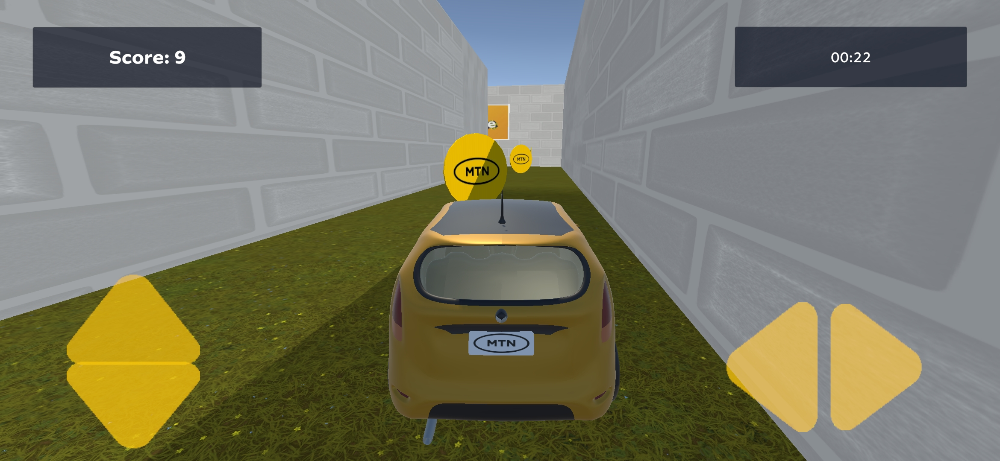
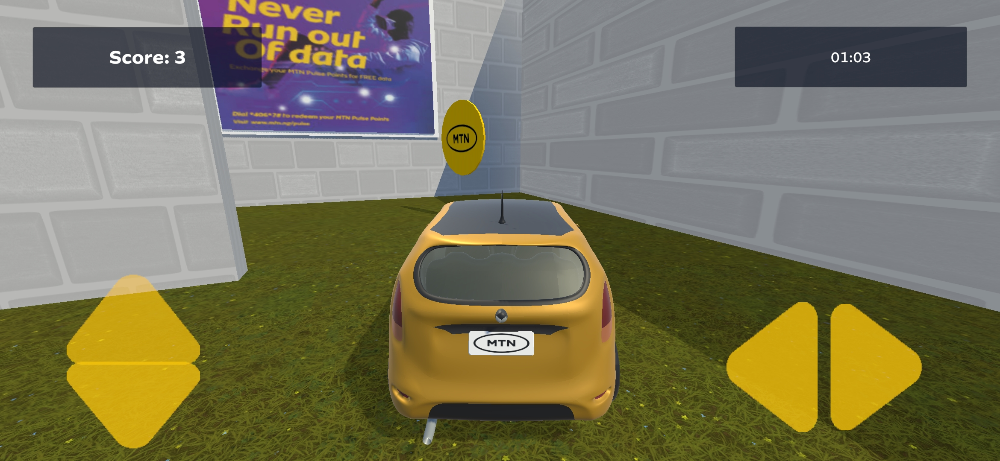
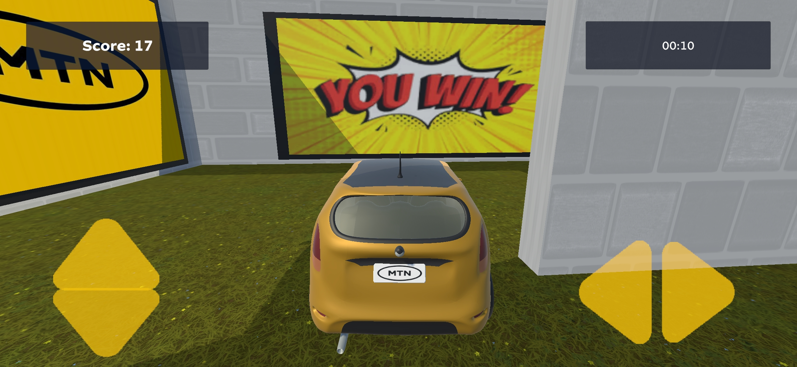

# MTN-Pulse-Car-Game---Demo
 
This is a demo of the MTN Pulse Car Game, where players drive a virtual car to collect MTN coins and win prizes. The game provides an engaging and interactive experience for users, combining entertainment with opportunities to earn rewards.

Key Features:
- Coin Collection: Players navigate the car through the maze to collect coins.
- Time-Based Gameplay: Players must collect as many coins as possible within a limited time.
- Prizes: Collected coins contribute to earning real-life prizes.
- Mobile-Optimized: The game is designed for mobile devices, ensuring smooth performance and responsive controls.

This project was created as a demo and is currently awaiting approval. The game is developed using Unity 3D, featuring a car controller, and a scoring system.

---

### Media
#### Gameplay
Player collecting coins in the maze.

